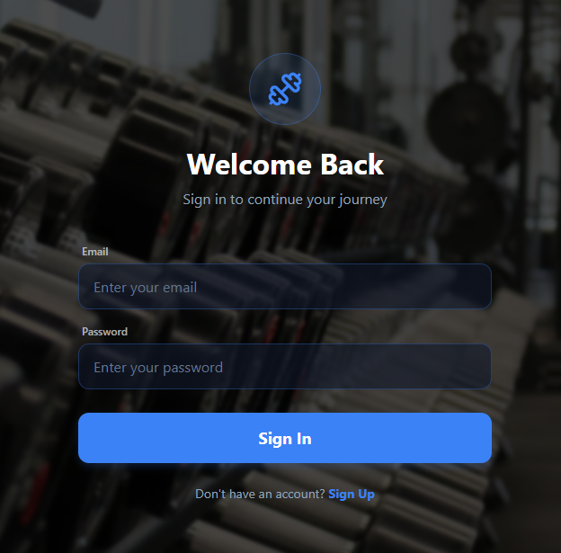
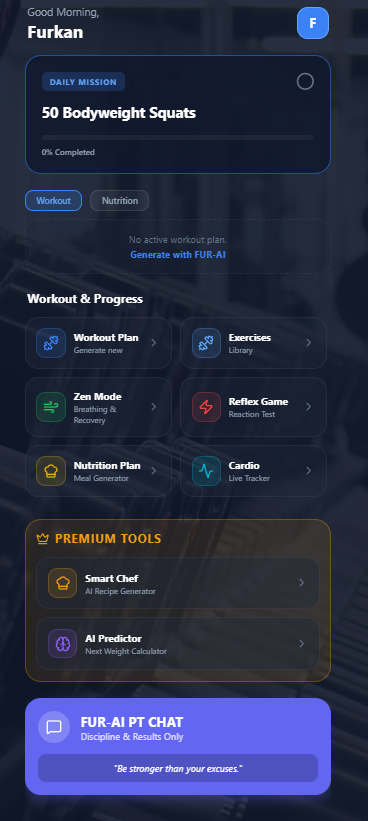
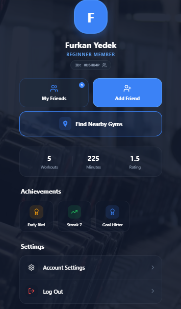
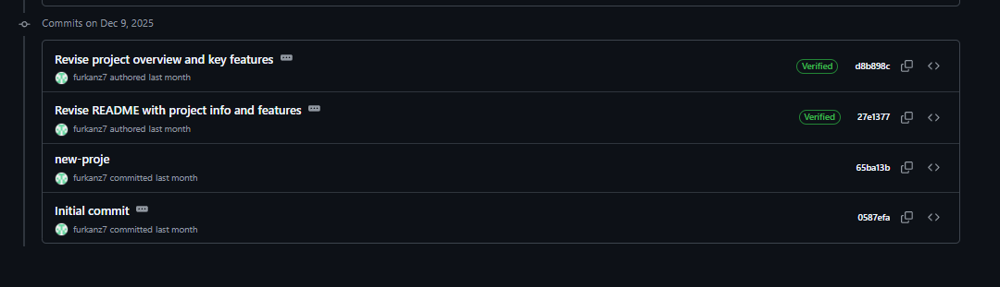

<div align="center">

# 🏋️‍♂️ KSOfit: KillerSkinnyObeseFIT
### "Vücut Tipin Kaderin Değil, Başlangıç Noktandır."

[](https://kotlinlang.org)
[](https://developer.android.com)
[](https://firebase.google.com/)
[](https://opensource.org/licenses/MIT)

<p align="center">
  <a href="#-proje-hakkında">Proje Hakkında</a> •
  <a href="#-özellikler">Özellikler</a> •
  <a href="#-teknik-mimari">Mimari</a> •
  <a href="#-kurulum">Kurulum</a> •
  <a href="#-gelecek-planları">Gelecek Planları</a>
</p>

</div>

---

## 📖 Proje Hakkında

**KSOfit**, Mobil Uygulama Geliştirme dersi final projesi olarak geliştirilmiş, kapsamlı bir kişisel fitness asistanıdır.

Uygulamanın ismindeki **KSOfit (KillerSkinnyObeseFIT)** felsefesi; kullanıcının başlangıç noktası **Zayıf (Skinny)**, **Obez (Obese)** veya formda olmak için **Hırslı (Killer)** olabilir; ancak nihai hedef herkes için **FIT** bir yaşamdır.

Bu proje, standart "hazır listeleri uygula" mantığının ötesine geçerek, kullanıcının kendi programını yönettiği ve arkadaşlarıyla etkileşime girdiği sosyal bir spor ekosistemidir.

---

## 📱 Ekran Görüntüleri

<div align="center">
  <table>
    <tr>
      <td align="center"><b>Giriş & Kayıt</b></td>
      <td align="center"><b>Ana Sayfa (Dashboard)</b></td>
      <td align="center"><b>Profil & İstatistik</b></td>
    </tr>
    <tr>
      <td></td>
      <td></td>
      <td></td>
    </tr>
  </table>
</div>

---

## ✨ Özellikler (Features)

Uygulama, **MVP (Minimum Viable Product)** kapsamının ötesinde, aşağıdaki gelişmiş özellikleri barındırır:

### 🏋️‍♂️ Antrenman Yönetimi
* **Kişiselleştirilebilir Programlar:** Kullanıcılar veritabanındaki yüzlerce hareket arasından seçim yaparak `Set x Tekrar` sayılarını kendileri belirleyip özel programlar oluşturabilirler.
* **Detaylı Egzersiz Kütüphanesi:** Her kas grubu için kategorize edilmiş hareketler ve nasıl yapılacağına dair açıklamalar.

### 🤝 Sosyal Ağ (Social Features)
* **Arkadaş Sistemi:** Kullanıcılar kullanıcı adlarıyla arkadaşlarını aratıp ekleyebilirler.
* **Liderlik Tablosu (Leaderboard):** Arkadaş listesindeki kişilerin aktivite puanlarına göre sıralanması. Rekabet ile motivasyon artırımı.

### 🧠 Akıllı Analiz
* **Dinamik BMI Hesaplama:** Kullanıcı verilerine (Boy, Kilo, Yaş, Cinsiyet) göre anlık Vücut Kitle İndeksi hesaplaması ve Dünya Sağlık Örgütü standartlarına göre renkli durum bildirimi.

### 🔐 Güvenlik ve Veri
* **Firebase Auth:** E-posta ve şifre ile güvenli kimlik doğrulama.
* **Cloud Firestore:** Tüm kullanıcı verilerinin ve antrenman programlarının bulutta senkronize saklanması.

---

## 🛠️ Teknik Mimari (Tech Stack)

Proje, **Modern Android Development (MAD)** standartlarına sıkı sıkıya bağlı kalınarak geliştirilmiştir.

| Bileşen | Teknoloji / Kütüphane | Açıklama |
| :--- | :--- | :--- |
| **Dil** | Kotlin | %100 Kotlin ile geliştirildi. |
| **Mimari** | MVVM (Model-View-ViewModel) | UI ve İş mantığının ayrılması (Separation of Concerns). |
| **UI** | XML & Material Design 3 | Kullanıcı dostu, modern bileşenler. |
| **Navigation** | Jetpack Navigation Component | Single Activity Architecture yapısı ve Fragment geçişleri. |
| **Data Binding** | ViewBinding | Null-safety UI erişimi için. |
| **Asenkron İşlemler** | Coroutines | Arka plan işlemleri ve ağ istekleri için. |
| **Backend** | Firebase | Auth, Firestore Database. |

### Mimari Şeması
`View (Fragment)` <--> `ViewModel (LiveData)` <--> `Repository` <--> `Firebase Data Source`

---

## 🤖 Yapay Zeka Entegrasyonu (AI Powered)

Projenin geliştirme sürecinin **%40'ında**, kod kalitesini optimize etmek ve karmaşık algoritmaları kurmak için **Gemini 2.5 Pro** kullanılmıştır.

> **Örnek Kullanım Senaryosu:**
> *BMI hesaplama algoritmasında karşılaşılan edge-case (sınır durum) hatalarının tespiti ve `ConstraintLayout` zincirleme yapılarının optimize edilmesi Gemini ile sağlanmıştır.*

---
## 📅 Versiyon Kontrol ve Geliştirme Süreci (Version Control History)

Proje, Git versiyon kontrol sistemi kullanılarak adım adım geliştirilmiştir. Aşağıda projenin başlangıç tarihini ve tüm geliştirme sürecini gösteren kanıtlar yer almaktadır.

### 1. İlk Commit Tarihi (Initial Commit Proof)
Projenin oluşturulduğu ve ilk dosyaların eklendiği tarihi gösteren ekran görüntüsü:

<p align="center">
  
</p>
<p align="center"><em>Şekil 1: Projenin başlangıç tarihini doğrulayan ilk commit kaydı.</em></p>


### 2. Tam Commit Geçmişi (Complete Commit History)
Proje boyunca yapılan tüm geliştirmeleri, hata düzeltmelerini ve eklenen özellikleri içeren commit geçmişinin tamamı:

<p align="center">
  
</p>
<p align="center"><em>Şekil 2: Geliştirme sürecini gösteren detaylı commit geçmişi.</em></p>

## 📅 Commit Geçmişi (Development Timeline)

Proje, akademik takvime uygun olarak 4 ana fazda tamamlanmıştır:

* `12.12.2025` - **Initial Commit:** Proje iskeleti, Gradle ayarları.
* `19.12.2025` - **Auth & MVVM:** Login/Register ekranları ve Mimari kurulumu.
* `28.12.2025` - **Core Features:** Program oluşturma, Sosyal özellikler ve BMI mantığı.
* **`04.01.2026`** - **Final Release:** UI İyileştirmeleri, Bug fixler ve Teslim.

---

## 🔮 Gelecek Planları (Future Scope)

Uygulamanın v2.0 sürümü için planlanan AR-GE çalışmaları:

- [ ] **Grafiksel İlerleme Takibi:** Kullanıcının ağırlık geçmişinin ve BMI değişiminin *MPAndroidChart* kütüphanesi ile görselleştirilmesi.
- [ ] **Giyilebilir Teknoloji:** *WearOS* entegrasyonu ile akıllı saat üzerinden nabız verisinin çekilmesi ve antrenman başlatılması.

---

## 🚀 Kurulum Adımları

Projeyi kendi bilgisayarınızda çalıştırmak için:

1.  **Repoyu Klonlayın:**
    ```bash
    git clone [https://github.com/furkanz7/KSOfit.git](https://github.com/furkanz7/KSOfit.git)
    ```
2.  **Android Studio'yu Açın:**
    `File > Open` menüsünden klonladığınız klasörü seçin.
3.  **Firebase Bağlantısı (Opsiyonel):**
    Kendi `google-services.json` dosyanızı `app/` klasörüne ekleyin (Mevcut olan sadece demo amaçlıdır).
4.  **Çalıştırın:**
    `Run` (Shift+F10) tuşuna basın.

---

<div align="center">

**Geliştirici:** Furkan Z.
<br>
*Mobil Uygulama Geliştirme Dersi Final Projesi - 2026*

[⬆️ Yukarı Çık](#-ksofit-killerskinnyobesefit)

</div>
